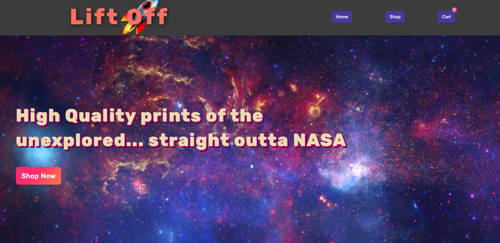
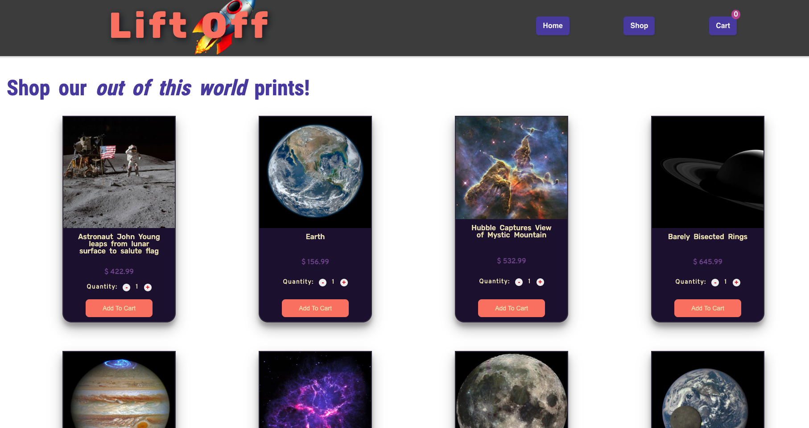
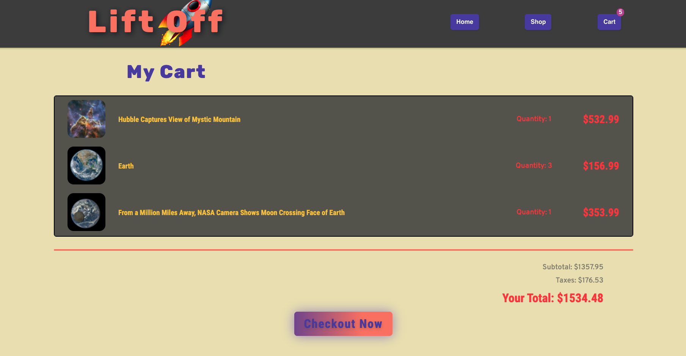

<div align="center">

## React Shopping Cart


</div>


### Table Of Contents:
1. [Live Deployment](#link-to-deployment)
2. [Getting Started](#getting-started)
3. [Description](#description)
4. [Pictures](#pictures)
5. [Functionality](#functionality)
6. [Technologies Used](#technologies-used)
7. [Things I Learned](#things-i-learned)
8. [License](#license)
9. [Acknowledgements](#acknowledgements)

### Link To Deployment
🖥 &nbsp; View a live demo of this project at: [Shopping Cart](https://epictetusz1.github.io/shopping-cart/)

<sup>[Back to top](#table-of-contents)</sup>

## Getting Started

1. ⬇️ Clone the repository to your local machine
   ```shell
   git clone git@github.com:EpictetusZ1/shopping-cart.git
   ```
2. Install project dependencies with npm
   ```shell
   npm install
   ```
3. 🏃‍ Run project
   ```shell
   npm run start
   ```

<sup>[Back to top](#table-of-contents)</sup>

## Description
An assignment from [The Odin Project](https://www.theodinproject.com/)

The motivation of this project was to better learn and implement React, and react router dom.

<sup>[Back to top](#table-of-contents)</sup>

## Pictures

Landing page with hero image and CTA, includes sticky cart-item counter



Products page with individual product cards 'add to cart' and 'increment' adjustment buttons



Checkout page with prices, tax calculation and order summary



<sup>[Back to top](#table-of-contents)</sup>

## Functionality

- Fetch data from nasa's Images API (The images API contains 4 endpoints```GET https://images-api.nasa.gov``` ) to populate store products dynamically
- Get image URLs from manifest (manifest follows 'Collection+JSON' formatting)
- Prices are also generated at random *once* in the component lifecycle then used throughout the users' entire session, never changing.
- App features 3 Routes:
    1. Home: ```"/"``` (This includes Hero image and CTA)
    3. Shop: ```"/shop"``` (Product Catalogue)
    4. Cart: ```"/shop/cart"```

<sup>[Back to top](#table-of-contents)</sup>

## Technologies Used

- React
    - react-router-dom package
    - ```create-react-app```
- NASA Images API (view documentation [here](https://images.nasa.gov/docs/images.nasa.gov_api_docs.pdf))
- JavaScript
- HTML5, CSS3
- CSS Modules

<sup>[Back to top](#table-of-contents)</sup>

## Things I Learned

- Handling API calls in Functional Components with the useEffect hook (equivalent to ```componentDidMount``` in class components)
    - ```useEffect( () => {... DoSomething} ,[])```
- The importance of preforming API calls **only once**, then setting the component state with the returned value
- The *intricacies* of updating Objects inside of Arrays (or any nested / deeply nested state) with the ```useState( (prevState) => ...prevState)```  syntax
    - Note: This has made me resent deeply nested state enough to learn Redux

<sup>[Back to top](#table-of-contents)</sup>

## License
Distributed under the MIT License. See `LICENSE.txt` for more information.

<sup>[Back to top](#table-of-contents)</sup>

## Acknowledgements

Images provided by: [NASA](https://api.nasa.gov/)

Project was authored by Jack Heaton - ([EpictetusZ1](https://github.com/EpictetusZ1)).

<sup>[Back to top](#table-of-contents)</sup>
